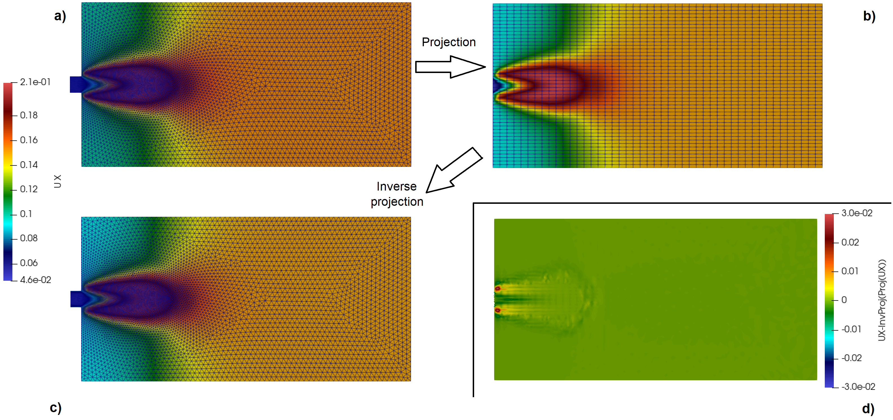
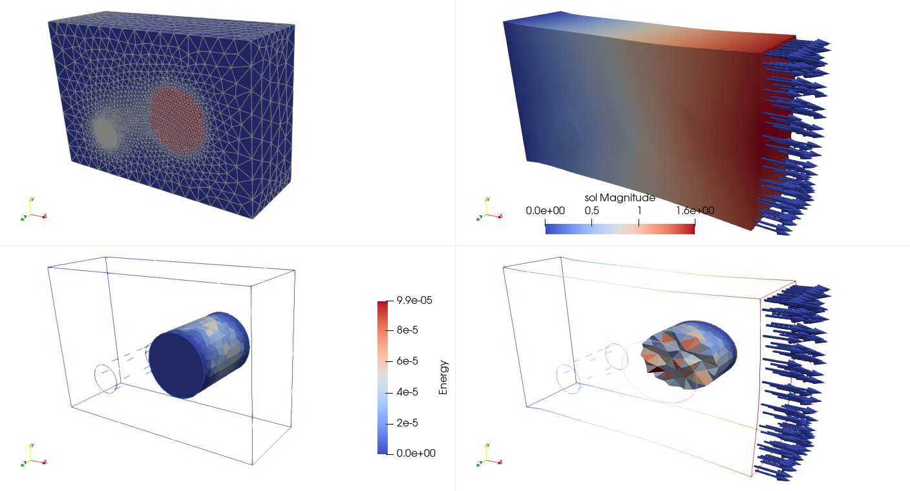

# Summary

Numerical simulations of physical phenomena can be computed by many (commercial/free) software packages, but despite the apparent variety, they rely on a relatively small set of operations when producing, preparing and consuming these simulations. For instance, post-treatments of physical fields are a common need, as well as handling and modifying meshes and fields. BasicTools is a Python library designed to address these supporting tasks. It features an efficient data model for meshes and field objects and input/output routines compatible with various formats. A finite element engine allows to assemble abstract variational formulations, take into account differential operators and integrate fields on volumes and surfaces.

BasicTools has been (and is still actively) used in various projects in artificial intelligence and model order reduction for physical problems [@ROM-net; @mca26010017; @UQindustrialDesign; @datatargetVAE], topology optimization [@nardoni] and material sciences [@pymicro].

# Statement of need

Oftentimes in real-world simulation, data is obtained from various sources, each of them providing its own encoding format. Every software package typically includes its own post-treatment tool, thus limiting interoperability and preventing to set up seamless workflows. Typically common tasks must be routinely reimplemented, often with subtle variations.

With BasicTools, we address these concerns by proposing a data model for meshes and associated physical fields, that can be populated thanks to various readers and exported by various writers. Additionally, many treatment tools are implemented on these meshes and physical fields, including a finite element engine and field projection operators. Notably no new mesh or solution format is forced upon the user: the goal is to handle existing data formats and offer common tasks and services on these data. Additionally BasicTools contains tools to convert meshes to other "in-memory" formats (Vtk [@VTK4], PyVista [@sullivan2019pyvista], MeshIO [@meshio]). This make possible to mix (and reuse) treatments already available in other frameworks.

# State of the field

In the computational fluid dynamics community, the CGNS [@cgns] standard has been proposed for analysis data. In the solid mechanics community, in the authors' knowledge, no such de facto standard exists. As far as meshes are concerned, one may consider MeshIO for converting between various file formats, or Vtk for the manipulation of meshes, although it lacks some capabilities of tremendous value for the solid mechanics community (e.g. integration point data). Finite element engines allowing to assemble abstract variational formulations are available in FreeFem++[@freefempp] and FEniCS [@fenics].

# Overview

The architecture of the source code is described below.

```
BasicTools
└───Containers
│   │   ConstantRectilinearMesh.py
│   │   UnstructuredMesh.py
│   │   Filters.py
│   │   ...
│
└───FE
│   └───Fields
│   └───Integrators
│   └───Spaces
│   └───WeakForms
│   └───...
│   │
│   │   FETools.py
│   │   Integration.py
│   │   ...
│
└───IO
│   │   XdmfReader.py
│   │   XdmfWriter.py
│   │   ...
│
└───ImplicitGeometry
│   ...
```
</a>

The main features of the library are

- meshes (in the folder `Containers`):
  ConstantRectilinearMesh.py and UnstructuredMesh.py define the data model for constant rectilinear and unstructured mesh types. Unstructured meshes are efficient in the sense that elements are stored using only one array for each element type. Both mesh types can feature nodes and element tags. Many functions are available for creating, cleaning and modifying meshes. In particular, field projection operations enable to project fields defined on a mesh onto a set of points, using various methods and options, with respect to the location of the destination points being inside or outside the origin mesh (finite element interpolation, extrapolation, clamped evaluations, nearest neighbors, zero fill). Mesh morphing capabilities are also included.
- filters (in the folder `Containers`):
  Various types of `ElementFilter` and `NodeFilter` enable to handle subparts of the meshes by selecting element- and node-sets using threshold functions, tags, element types, element dimensionality and masks. Arbitrary filters can be combined using boolean operations (union, complementary...) to construct advanced filters on points and elements.
- a finite element engine (in the folder `FE`):
  A general weak formulation engine able to integrate fields over any part of the considered mesh is available. FETools.py contains specific functions for Lagrange P1 finite elements, including the computation of stiffness and mass matrices. The domain of integration is defined using `ElementFilter`s to make the integration domain flexible. Depending on the parameter of the integration, the result can be a matrix (e.g. tangent operator), a vector (e.g. right hand side term), or a scalar (e.g. volume, energy)
- input/output functions (in the folder `IO`):
  Various readers (respectively, writers) for importing (exporting) meshes and solution fields from (to) the internal data model of BasicTools are available. Available formats include geo/geof (Z-set [@zset]), vtk, xdmf, samcef, abaqus. The bridge with MeshIO brings extra import/export capabilities by wrapping the MeshIO readers/writers with the BasicTools API.
- implicit geometry engine (in the folder `ImplicitGeometry`):
  The classes are used to define arbitrary subdomains using only implicit geometries (level-set function). Basic shapes (spheres, half-spaces, cylinders, cubes), transformations (symmetry, translation, rotation) as well as binary operators (union, difference, intersection) can be used to construct complex shapes. Then these shapes can be used to select elements (using an `ElementFilter`), or be evaluated on a point cloud (e.g. the points of a mesh) to explicitly construct the iso-zero surface.

The large majority of functions are illustrated in the same file where they are defined, in `CheckIntegrity` functions. Additionally, some feature are illustrated below.

# Examples

We detail two examples illustrating some of the features mentioned in the previous section.
The complete examples can be found in the BasicTools documentation.

## Pre/post deep learning

A class of deep learning workflow applied to physical simulation require the projection of fields defined on an unstructured mesh onto a rectilinear grid, and inversely.



The mesh and solution associated with a previously computed flow field is read (see also \autoref{fig:DeepLearningPrepost}, top-left image):

```python
reader = XR.XdmfReader(filename="PrePostDeepLearning_Input.xmf")
reader.Read()

grid = reader.xdmf.GetDomain(0).GetGrid(0)

# Read the mesh
uMesh = grid.GetSupport()
# Convert all data to the correct binary (float64, int64) representation
# for the c++ part of BasicTools
uMesh.ConvertDataForNativeTreatment()

# Read the solution field 'U'
indexU = grid.GetPointFieldsNames().index("U")
U = grid.GetPointFields()[indexU][:, 0:2]
```

A rectilinear mesh of size 48*48 excluding the left part of the mesh (x<0) is created:

```python
uMesh.ComputeBoundingBox()
Lx = uMesh.boundingMax[0] - 0.
Ly = uMesh.boundingMax[1] - uMesh.boundingMin[1]
rectMesh = ConstantRectilinearMesh(dim=2)
Nx = 48; Ny = 48
rectMesh.SetDimensions([Nx, Ny])
rectMesh.SetSpacing([Lx/(Nx-1), Ly/(Ny-1)])
rectMesh.SetOrigin([0., uMesh.boundingMin[1]])
```

The projection operator from the unstructured mesh to the structured mesh is computed and applied (see also \autoref{fig:DeepLearningPrepost}, top-right image):

```python
# Compute the projected field on the structured mesh
unstructuredRectMesh = CreateMeshFromConstantRectilinearMesh(rectMesh)
space, numberings, _offset, _nGauss =  PrepareFEComputation(uMesh)
inputFEField = FEField(name="U", mesh=uMesh, space=space, \
    numbering=numberings[0])
method = "Interp/Clamp"
operator, status = GetFieldTransferOp(inputFEField, \
    unstructuredRectMesh.nodes, method=method, verbose=True)

# Application of the projection
projectedU = operator.dot(U)
```

The projection operator from the structured mesh to the unstructured mesh (inverse projection) is computed and applied (see also \autoref{fig:DeepLearningPrepost}, bottom-left image):

```python
# Compute the inverse-projected projected field on the unstructured mesh
space, numberings, _os, _nG = PrepareFEComputation(unstructuredRectMesh)
inputFEField = FEField(name="U", mesh=unstructuredRectMesh, \
    space=space, numbering=numberings[0])
method = "Interp/Clamp"
operator, status = GetFieldTransferOp(inputFEField, uMesh.nodes, \
    method=method, verbose=True)

# Application of the projection
inverseProjected_ProjectedU = operator.dot(projectedU)
```

The difference between the initial solution field and the result of the projection, then inverse projection of this field is illustrated on \autoref{fig:DeepLearningPrepost}, bottom-right image.

## Mechanical analysis: Thick plate with 2 inclusions

Here we present a study case of a thick plate with 2 inclusions: one softer and the other stiffer than the base material. We then compute the strain energy on only one inclusion.



```python
# Include statements omitted for the sake of clarity

# Main class to drive a linear finite element analysis
problem = UnstructuredFeaSym()

# The mechanical problem (formulas for the weak form)
mecaPhys = MecaPhysics()
# Definition of the degree of the spaces [1 or 2]
mecaPhys.SetSpaceToLagrange(P=1)

# Add weak form terms to the tangent matrix
mecaPhys.AddBFormulation("Bulk", mecaPhys.GetBulkFormulation(1.0, 0.3))
mecaPhys.AddBFormulation("Inclusion1", mecaPhys.GetBulkFormulation(5.0, 0.3))
youngModulusInclusionII = 0.5
mecaPhys.AddBFormulation("Inclusion2", mecaPhys.GetBulkFormulation(0.5, 0.3))

# Add weak form term to the rhs
mecaPhys.AddLFormulation( "Right", mecaPhys.GetForceFormulation([1, 0, 0], 1))

# Push the physics into the FE problem
problem.physics.append(mecaPhys)

# The boundary conditions (block u,v,w on the left part of the mesh)
dirichlet = KRBlockVector()
dirichlet.AddArg("u").On('Left').Fix0().Fix1().Fix2()

problem.solver.constraints.AddConstraint(dirichlet)

# Read The mesh
mesh = ReadGmsh("TwoInclussions.msh")
mesh.ConvertDataForNativeTreatment()
print(mesh)

# Set the mesh into the problem
problem.SetMesh(mesh)

# We compute the numbering (mapping from the mesh to the linear system)
problem.ComputeDofNumbering()

# Assembly the linear system
with Timer("Assembly"):
    k, f = problem.GetLinearProblem()

# Compute the constraints to add to the system
problem.ComputeConstraintsEquations()

with Timer("Solve"):
    problem.Solve(k, f)

# Push the data from the solution vector to the FEFields
problem.PushSolutionVectorToUnkownFields()

# Recover a point representation of the displacement
# This is a no-op if the degree of the interpolation is 1 (P=1)
problem.mesh.nodeFields["sol"] = GetPointRepresentation(problem.unkownFields)

# Creation of a fake fields to export the rhs member
rhsFields = [FEField(mesh=mesh, space=None, \
    numbering=problem.numberings[i]) for i in range(3)]
VectorToFEFieldsData(f, rhsFields)
problem.mesh.nodeFields["RHS"] = GetPointRepresentation(rhsFields)

print("Done solve")
print("Compute of the strain energy only on the second inclusion")
print("(integral in each element)")

symdep = GetField("u", 3)
K = HookeIso(youngModulusInclusionII, 0.3, dim=3)
# This is the projection space
symCellDataT = SWF.GetTestField("cellData", 1)

print("Post process")
strainInVoigt = ToVoigtEpsilon(Strain(symdep))
EnerForm = strainInVoigt.T * K * strainInVoigt * symCellDataT

print("Post process Eval")
# Set the integration domain
ff = ElementFilter(mesh=problem.mesh, tag="Inclusion2")
p0Numbering = ComputeDofNumbering(mesh, LagrangeSpaceP0)
energyDensityField = FEField(name="cellData", mesh=mesh, \
    numbering=p0Numbering, space=LagrangeSpaceP0)

# This is the actual integration, because the target space is constant
# by element, we obtain for each element the strain energy
m, energyDensity = IntegrateGeneral(mesh=problem.mesh, wform=EnerForm, \
    constants={}, fields=problem.unkownFields, \
    unkownFields = [energyDensityField], elementFilter=ff)

energyDensityField.data = energyDensity

problem.mesh.elemFields["Energy"] = energyDensity

import numpy as np
print("Strain energy on the second inclusion:", np.sum(energyDensity))

writer = XdmfWriter.XdmfWriter('TwoInclussions_Output.xdmf')
writer.SetHdf5(False)
writer.Open()
writer.Write(mesh,PointFields=list(mesh.nodeFields.values()), \
                  PointFieldsNames=list(mesh.nodeFields.keys()), \
                  CellFields=list(mesh.elemFields.values()), \
                  CellFieldsNames=list(mesh.elemFields.keys()))
writer.Close()
```

<!---
# Acknowledgements

The authors wish to thank Julien Cortial (Safran) for his contributions to the library.
-->

# References
