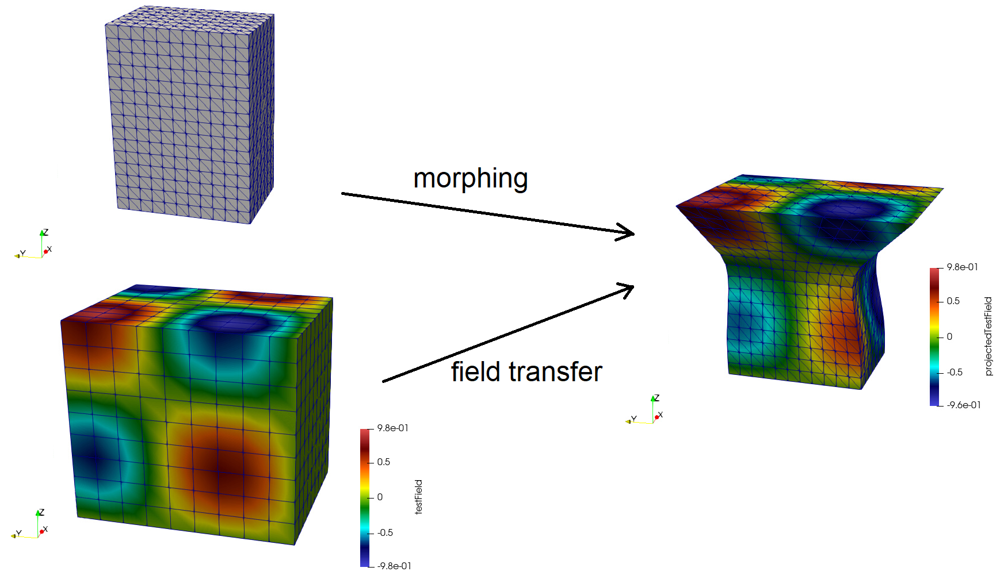

# Summary

Numerical simulations of physical phenomena can be computed by many (commercially/free) software are computed by various available codes, but many similar operations are required when producing preparing and consuming these simulations. Post-treatments of physical fields are a common need, as well as handling and modifying meshes and fields. BasicTools is a library designed especially to address these supporting tasks. It contains an efficient data model for meshes and field objects and input/output routines compatible with various formats. A finite element engine allows the assembling of abstract variational formulations, differential operators and the integration of fields on volume and surfaces.

BasicTools has been used in various projects in artificial intelligence and model order reduction for physical problems [@ROM-net; @mca26010017; @UQindustrialDesign; @datatargetVAE], topological optimization [@nardoni] and material sciences [@pymicro].

# Statement of need

When considering numerical simulation data from various sources, different formats may be handled. Each software can include its own post-treatment tool, which complexifies any comparison task or workflows mixing computation from different origins. Hence, common tasks and post-treatment may be recoded numerous times.

With BasicTools, we address these assessments by proposing a data model for meshes and associated physical fields, that is populated thanks to various reader and can be exported by various writers. Additionally, many treament tools are implemented on these meshes and physical fields, including a finite element engine and field projection operators. We underline the fact that no new mesh or solution format is being specified: the goal is not to try and impose a new standard, but rather to handle existing data formats and propose common tasks and services on these data.

# State of the field

In the computational fuild dynamics community, the CGNS [@cgns] standard has been proposed for analysis data. Concerning meshes, meshio [@meshio] has been proposed for conversion between various formats. In the solid mechanics community, up to our knowledge, no such standard exists. Finite element engines allowing to assembla abstract variational formulations are available in the codes FreeFem++[@freefempp] and FEniCS [@fenics].


# Overview

The architecture of the source code is described below.

```
BasicTools
└───Containers
│   │   ConstantRectilinearMesh.py
│   │   UnstructuredMesh.py
│   │   Filters.py
│   │   ...
│
└───FE
│   └───Fields
│   └───Integrators
│   └───Spaces
│   └───WeakForms
│   └───...
│   │
│   │   FETools.py
│   │   Integration.py
│   │   ...
│
└───IO
│   │   XdmfReader.py
│   │   XdmfWriter.py
│   │   ...
│
└───ImplicitGeometry
│   ...
```
</a>

The main objects and features of the library are

- meshes (in the folder Containers):
  ConstantRectilinearMesh.py and UnstructuredMesh.py define the datamodel for self-explicit mesh types. Unstructured meshes are efficient in the sense that elements are stored using only one array for each element type. Both mesh types can feature nodes and element tags. Many functions are available for creating, cleaning and modifying meshes. In particular, field projection operations enable to project fields defined on a mesh onto a set of points, using various methods and options, with respect to the location of the destination points being inside or outside the origin mesh (finite element interpolation, extrapolation, clamped evaluations, nearest neighbors, zero fill). Mesh morphing capacities are also included.
- filters (in the folder Containers):
  ElementFilter and NodeFilter enable to easily handle subparts of the meshes, either by selecting element and node set using threshold functions, tags, element types, as well as boolean operations.
- a finite element engine (in the folder FE):
  A general weak formulation engine is available, enable to integrate fields over any part of the considered mesh. FETools.py contains particular functions for Lagrange P1 finite elements, including the computation of stiffness and mass matrices.
- input/output functions (in the folder IO):
  Various readers and writer converting mesh and solution data from and into the internal data model. Available formats include geo/geof (Z-set [@zset]), vtk, xdmf, samcef, abaqus.
- level-set functions (in the folder ImplicitGeometry):
  Definition of implicit geometries, computation of distances.

The large majority of functions are illustrated in the same file where they are defined, in CheckIntegrity functions. Additionally, some feature are illustrated below.

# Examples

We detail two examples illustrating some of the features listed in the previous section.
[TODO: rendre les tuto disponibles dans le dépôt basictools, et le dire ici (pour les inludes)].

## Pre/post deep learning

Some deep learning workflow applied to physics contexts require the projection of fields defined on an unstructured mesh onto a rectilinear grid, and inversely.


The mesh and solution associated to a previously computed flow field is read (see also \autoref{fig:DeepLearningPrepost}, top-left image):

```python
reader = XR.XdmfReader(filename = "solution.xmf")
reader.Read()

dom = reader.xdmf.GetDomain(0)
grid = dom.GetGrid(0)

# Read the mesh
unstructuredMesh = grid.GetSupport()

# Read the solution field 'U'
indexU = grid.GetPointFieldsNames().index("U")
U = grid.GetPointFields()[indexU][:,0:2]
```

A rectilinear mesh of size 48*48 excluding the left part of the mesh (x<0) is created:

```python
unstructuredMesh.ComputeBoundingBox()
Lx = unstructuredMesh.boundingMax[0] - 0.
Ly = unstructuredMesh.boundingMax[1] - unstructuredMesh.boundingMin[1]  
rectMesh = ConstantRectilinearMesh(dim=2)
Nx = 48; Ny = 48
rectMesh.SetDimensions([Nx,Ny])
rectMesh.SetSpacing([Lx/(Nx-1), Ly/(Ny-1)])
rectMesh.SetOrigin([0.,unstructuredMesh.boundingMin[1]])
```

The projection operator from the unstructured mesh to the structured mesh is computed (see also \autoref{fig:DeepLearningPrepost}, top-right image):

```python
unstructuredRectMesh = CreateMeshFromConstantRectilinearMesh(rectMesh)
space, numberings, _offset, _NGauss = \
PrepareFEComputation(unstructuredMesh, numberOfComponents = 2)
inputFEField = FEField(name="U", mesh=unstructuredMesh, \
space=space,numbering=numberings[0])
method = "Interp/Clamp"
operator, status = GetFieldTransferOp(inputFEField, \
unstructuredRectMesh.nodes, method = method, verbose=True)

# Compute the projected field on the structured mesh
projectedU = operator.dot(U)
```

The projection operator from the structured mesh to the unstructured mesh (inverse projection) is computed (see also \autoref{fig:DeepLearningPrepost}, bottom-left image):

```python
space, numberings, _offset, _NGauss = PrepareFEComputation(unstructuredRectMesh)
inputFEField = FEField(name="U", mesh=unstructuredMeshB, \
space=space,numbering=numberings[0])
method = "Interp/Clamp"

operator, status = GetFieldTransferOp(inputFEField, \
unstructuredMesh.nodes, method = method, verbose=True)

# Compute the inverse-projected projected field on the unstructured mesh
inverseProjected_ProjectedU = operator.dot(projectedU)
```

The difference between the initial solution field and the result of the projection, then inverse projection of this field is illustrated on \autoref{fig:DeepLearningPrepost}, bottom-right image.

## Mesh morphing and field transfer and integration

Mesh morphing and field projection and integration are now illustrated: commands are given and explained below.



A rectilinear mesh is constructed (see also \autoref{fig:MeshMorphFieldProj}, top-left image):

```python
# Construct a rectilinear mesh of size 8*12*16 
structuredMesh = ConstantRectilinearMesh(dim=3)
structuredMesh.SetDimensions([8,12,16])
structuredMesh.SetOrigin([0.,0.,0.])
structuredMesh.SetSpacing([0.1,0.1,0.1])

# Convert to unstructured mesh 
unstructuredMesh = CreateMeshFromConstantRectilinearMesh(structuredMesh,
                                                         ofTetras=True)

# Export the unstructured mesh in xdmf format
writer = XW.XdmfWriter()
writer.SetXmlSizeLimit(0)
writer.SetBinary(True)
writer.Open(filename='init.xdmf')
writer.Write(unstructuredMesh, PointFields = [], PointFieldsNames = [])
writer.Close()
```

The mesh is transformed by applying a displacement only on the top part of the skin of the mesh, and morphing the rest of the position of the nodes (see also \autoref{fig:MeshMorphFieldProj}, right image):

```python
# Construct an element tag corresponding to the skin of the mesh 
ComputeSkin(unstructuredMesh, inplace=True)

# Construct an nodeFilter filtering nodes of the skin such that z>1
nodeFilter = NodeFilter(unstructuredMesh)
nodeFilter.AddETag("Skin")
nodeFilter.AddZone(lambda p: 1-p[:,2])

# Add a nodeTag tagging the elements of nodeFilter
idsToTreat = nodeFilter.GetIdsToTreat()
nodalTag = unstructuredMesh.GetNodalTag("ImposedDisp")
nodalTag.AddToTag(idsToTreat)

# Compute a displacement and apply it to the selected nodes
posIdsToTreat = unstructuredMesh.GetPosOfNodes()[idsToTreat]

dispIdsToTreat = np.zeros(posIdsToTreat.shape)
dispIdsToTreat[:,0] = (posIdsToTreat[:,2]-1)*(posIdsToTreat[:,0]-1)
dispIdsToTreat[:,1] = (posIdsToTreat[:,2]-1)*(posIdsToTreat[:,1]-1)

# Morph the mesh by updated the position of the nodes
morphedNodes = Morphing(unstructuredMesh, dispIdsToTreat, idsToTreat)
unstructuredMesh.SetNodes(morphedNodes)
```

A field is constructed, supported on a bounding box of the morphed mesh (see also \autoref{fig:MeshMorphFieldProj}, bottom-left image):

```python
# Construct a rectilinear mesh of size 10*10*10 for the bounding box of
# the morphed mesh
unstructuredMesh.ComputeBoundingBox()

structuredMeshB = ConstantRectilinearMesh(dim=3)
n = 10
spacing = [
  (unstructuredMesh.boundingMax[i]-unstructuredMesh.boundingMin[i])/(n-1)
  for i in range(3)
]
structuredMeshB.SetDimensions([n,n,n])
structuredMeshB.SetOrigin(unstructuredMesh.boundingMin)
structuredMeshB.SetSpacing(spacing)

# Construct a field supported on this rectilinear mesh
testField = np.empty(n**3)
structuredMeshBNodes = np.empty((n**3,3))
count = 0
for i in range(n):
    x = i*spacing[0]
    for j in range(n):
        y = j*spacing[1]
        for k in range(n):
            z = k*spacing[2]
            testField[count] = \
            np.sin(np.pi*(0.25+x))*np.sin(np.pi*y)*np.sin(np.pi*z)
            structuredMeshBNodes[count,:] = [x,y,z]
            count += 1
```

A projection field operator is computed and used to project the field considered field from the bounding box mesh onto the morphed mesh:

```python
# Compute the projection operator from the rectilinear mesh to the
# morphed unstructured mesh
unstructuredMeshB = CreateMeshFromConstantRectilinearMesh(structuredMeshB)
space, numberings, _offset, _NGauss = \
PrepareFEComputation(unstructuredMeshB, numberOfComponents = 1)
inputFEField = FEField(name="testField", mesh=unstructuredMeshB, \
space=space,numbering=numberings[0])
operator, status = GetFieldTransferOp(inputFEField, \
unstructuredMesh.nodes, method = "Interp/Clamp", verbose=True)

# Compute the projected field on the morphed unstructured mesh
projectedTestField = operator.dot(testField)
```

The morphed unstructured mesh containing the projected field is exported in xdmf format (see also \autoref{fig:MeshMorphFieldProj}, right image):
```python
writer = XW.XdmfWriter()
writer.SetXmlSizeLimit(0)
writer.SetBinary(True)
writer.Open(filename='morphed.xdmf')
writer.Write(unstructuredMesh, PointFields = [projectedTestField], \
PointFieldsNames = ["projectedTestField"])
writer.Close()
```

The previouly defined 3D field on the morphed mesh is now integrated over the top part of the surface of the morphed mesh using two methods (integrationResult1 and integrationResult2):
```python
# Construct an nodeFilter filtering elements of the skin
elFilter = ElementFilter(unstructuredMesh)
elFilter.AddTag("Skin")

#### Method 1
integrationWeights, phiAtIntegPoint = \
ComputePhiAtIntegPointFromElFilter(unstructuredMesh, elFilter)
integrationResult1 = np.dot(integrationWeights, \
phiAtIntegPoint.dot(projectedTestField))

#### Method 2
F = GetField("F",1)
Tt = GetTestField("T",1)

wf = F.T*Tt

numbering = ComputeDofNumbering(unstructuredMesh,LagrangeSpaceP1)
field = FEField("F", mesh=unstructuredMesh, space=space, \
numbering=numbering, data = projectedTestField)

numbering = ComputeDofNumbering(unstructuredMesh, \
ConstantSpaceGlobal, fromConnectivity=True)
unkownField = FEField("T", mesh=unstructuredMesh, \
space=ConstantSpaceGlobal,numbering=numbering)

K, F = IntegrateGeneral(mesh=unstructuredMesh,
                    wform=wf,
                    constants={},
                    fields=[field],
                    unkownFields=[unkownField],
                    integrationRuleName="LagrangeP1",
                    elementFilter=elFilter)

integrationResult2 = F[0]
```

# Acknowledgements

The authors wish to thank Julien Cortial (Safran) for his contributions to the library.

# References

<!-- 
# Citations
Citations to entries in paper.bib should be in
[rMarkdown](http://rmarkdown.rstudio.com/authoring_bibliographies_and_citations.html)
format.

If you want to cite a software repository URL (e.g. something on GitHub without a preferred
citation) then you can do it with the example BibTeX entry below for @fidgit.

For a quick reference, the following citation commands can be used:
- `@author:2001`  ->  "Author et al. (2001)"
- `[@author:2001]` -> "(Author et al., 2001)"
- `[@author1:2001; @author2:2001]` -> "(Author1 et al., 2001; Author2 et al., 2002)"

# Figures

Figures can be included like this:

and referenced from text using \autoref{fig:example}.

Figure sizes can be customized by adding an optional second parameter:
{ width=20% }

# Mathematics

Single dollars are required for inline mathematics e.g. $f(x) = e^{\pi/x}$

Double dollars make self-standing equations:

$$\Theta(x) = \left\{\begin{array}{l}
0\textrm{ if } x < 0\cr
1\textrm{ else}
\end{array}\right.$$

You can also use plain \LaTeX for equations
\begin{equation}\label{eq:fourier}
\hat f(\omega) = \int_{-\infty}^{\infty} f(x) e^{i\omega x} dx
\end{equation}
and refer to \autoref{eq:fourier} from text.

 -->